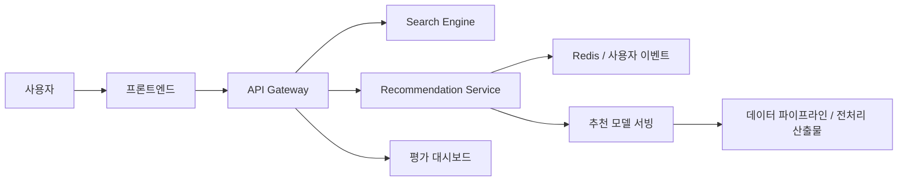

# FitFind

패션 상품을 텍스트와 이미지로 검색하고, 사용자 취향과 예산 조건을 반영해 추천까지 제공하는 멀티모달 검색·추천 시스템입니다.  
검색 엔진, 추천 모델, API 게이트웨이, 대시보드까지 하나의 서비스 형태로 통합해 구현했습니다.

이 저장소는 팀 프로젝트 결과물을 포트폴리오 용도로 정리한 공개 버전입니다.

## 프로젝트 개요

- 과목: 캡스톤디자인
- 형태: 팀 프로젝트
- 목표:
  - 텍스트/이미지 기반 패션 상품 검색
  - 사용자 행동 기반 개인화 추천
  - 예산 조건을 반영한 코디 추천
  - 성능 지표와 대시보드를 통한 결과 확인

## 내가 맡은 역할

저는 아래 영역을 중심으로 참여했습니다.

- 데이터 처리 및 관리 보조
- 추천 모델 개발 보조
- 추천 실험 결과 정리 및 파이프라인 보조

포트폴리오 관점에서 특히 확인할 수 있는 코드 영역은 다음과 같습니다.

- [`data_pipeline/`](./data_pipeline)
- [`persona/`](./persona)
- [`rec_models/`](./rec_models)
- [`evaluation/`](./evaluation)

## 팀 구성

- 이준원: 데이터 처리 및 관리, 추천모델 개발 보조
- 홍찬근: 멀티모달 검색 구현
- 장지원: 추천 모델 메인 개발
- 오승민: 백엔드 개발
- 손석범: 평가 및 대시보드 구현, 프론트엔드

## 핵심 기능

- `CLIP + FAISS` 기반 멀티모달 검색
- 사용자 이력 기반 개인화 추천
- Two-Tower 기반 candidate retrieval
- Logistic Regression 기반 ranking
- e-Greedy / UCB 기반 탐색 로직
- Redis 기반 실시간 행동 반영
- 대시보드 기반 성능 모니터링

## 시스템 구조

## 사용 기술

| 영역 | 기술 |
| --- | --- |
| 검색 | CLIP, FAISS |
| 추천 | Two-Tower, Logistic Regression, Bandit |
| 백엔드 | FastAPI, Redis, Docker Compose |
| 프론트엔드 | React, Vite, TypeScript |
| 대시보드 | Streamlit |
| 데이터 | H&M Personalized Fashion Recommendations |

## 주요 결과

### 검색 성능

`search_engine/docs/search_experiments.md` 기준 결과입니다.

| 모달리티 | MRR | NDCG@10 | HitRate@10 | 평균 API 지연(ms) | 결과 |
| --- | ---: | ---: | ---: | ---: | --- |
| 텍스트 | 0.8667 | 0.8243 | 1.0000 | 97.89 | PASS |
| 이미지 | 0.6500 | 0.5554 | 0.8000 | 488.56 | FAIL |
| 하이브리드 | 0.6622 | 0.6892 | 1.0000 | 449.39 | FAIL |

텍스트 검색은 목표 지연 시간과 정확도를 만족했고, 이미지/하이브리드 검색은 정확도는 확보했지만 지연 시간이 더 개선되어야 하는 상태였습니다.

### 추천 성능

`rec_models/serving/README.md` 기준 검증 결과입니다.

| 항목 | 수치 |
| --- | ---: |
| Candidate Recall@300 | 0.614632 |
| Ranking AUC | 0.956739 |
| HitRate@50 | 0.497000 |
| NDCG@50 | 0.178138 |
| Coverage@50 | 0.215203 |
| Latency p95 | 187.61ms |

추천 파이프라인은 후보 생성, 랭킹, 다양성/탐색 보정까지 포함한 서비스형 구조로 구성했고, `p95 200ms` 이내 응답을 목표로 조정했습니다.

## 화면 예시

| 시작 화면 | 검색 결과 |
| --- | --- |
|  |  |

| 페르소나 화면 | 대시보드 |
| --- | --- |
|  |  |

## 시연 자료

- 시연 영상은 별도 보유 중이며, 공개 범위를 정리한 뒤 저장소에 연결할 수 있습니다.

## 디렉터리 안내

- [`search_engine/`](./search_engine): 멀티모달 검색 엔진
- [`rec_models/`](./rec_models): 추천 모델 학습 및 서빙
- [`api_gateway/`](./api_gateway): 통합 API
- [`evaluation/`](./evaluation): 지표 계산 및 대시보드
- [`data_pipeline/`](./data_pipeline): 전처리 및 파생 데이터 생성
- [`dashboard/`](./dashboard): 대시보드 관련 자산

## 포트폴리오 관점 정리

이 프로젝트는 단순 모델 실험이 아니라, 검색과 추천을 하나의 사용자 경험으로 묶은 서비스형 AI 시스템이라는 점이 강점입니다.  
포트폴리오에서는 다음 역량을 보여주는 프로젝트로 활용할 수 있습니다.

- 멀티모달 검색 시스템 이해
- 추천 시스템 파이프라인 이해
- 데이터 전처리와 오프라인 평가 흐름 구성
- 서비스형 백엔드와 대시보드 연결 경험

